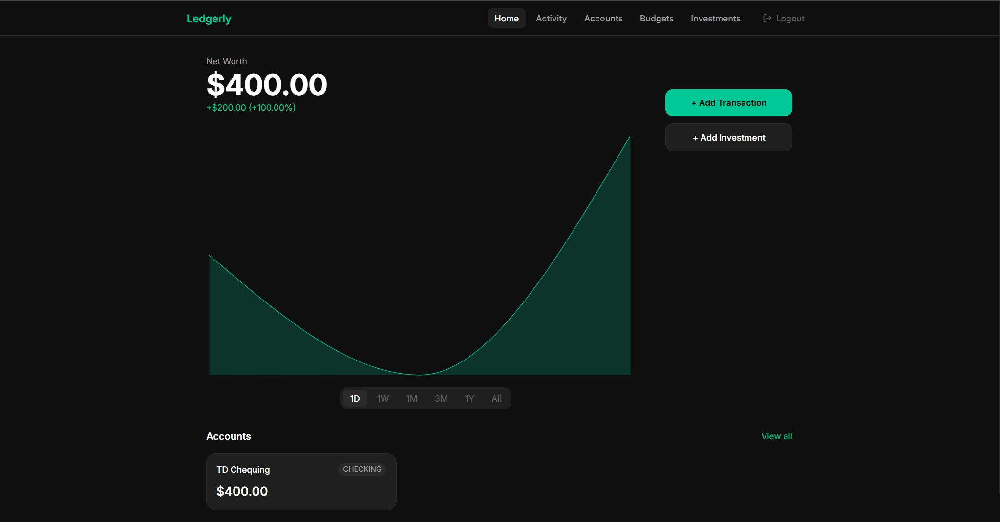
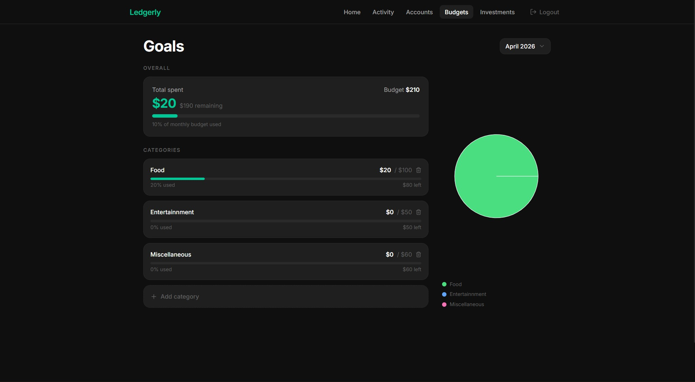

# Ledgerly
A personal finance platform inspired by Wealthsimple, built to manage budgets, track investments, and visualize net worth with AI-powered tools.

🔗 **Live Demo:** [https://ledgerly-wine.vercel.app/](https://ledgerly-wine.vercel.app/)  

---

## 🚀 Key Features
- **AI-driven transaction input:** Add expenses and income using natural language via Google Gemini API.  
- **Portfolio tracking:** Monitor stocks, ETFs, and cryptocurrencies with live prices through Yahoo Finance API.  
- **Net worth visualization:** Interactive graphs across multiple timeframes (1D, 1W, 1M, 3M, 1Y).  
- **Budget goals:** Track spending per category, set goals, and get detailed breakdowns.  
- **Secure authentication:** NextAuth.js with JWT sessions and bcrypt hashing for user security.  

---

## 🛠 Tech Stack
- **Frontend:** Next.js 14 App Router, React 18, TypeScript, Tailwind CSS v4  
- **Backend:** Next.js API Routes, Prisma ORM, PostgreSQL (Neon)  
- **Authentication:** NextAuth.js, bcrypt, JWT  
- **APIs & Integrations:** Google Gemini, Yahoo Finance  

---

## 💻 Screenshots
<div align="center">
  
  
</div>

---

## ⚙️ Running Locally
```bash
# Clone the repo
git clone <repo-url>
cd ledgerly

# Install dependencies
npm install

# Set up environment variables
cp .env.example .env
# Fill in your API keys

# Run database migrations
npx prisma migrate dev

# Start development server
npm run dev